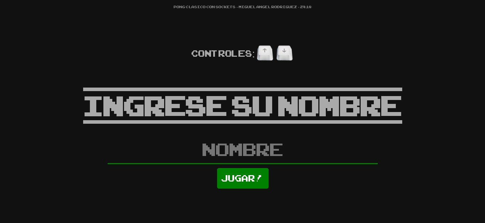
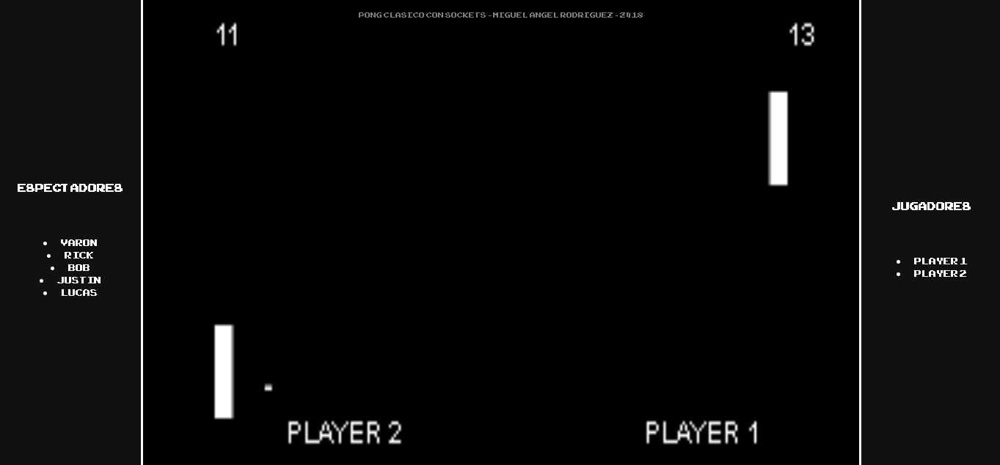

# pongMultiplayer
pong made with node js and socket.io

<br>
<br>

## installation
Before installing, [download and install Node.js](https://nodejs.org/en/download/).
Node.js 0.10 or higher is required.

Installation is done using the
[`npm install` command](https://docs.npmjs.com/getting-started/installing-npm-packages-locally):

```bash
  $ npm install
  $ npm start
```

## People

author [Miguel Rodriguez](https://github.com/MiguelRodriguezR)
